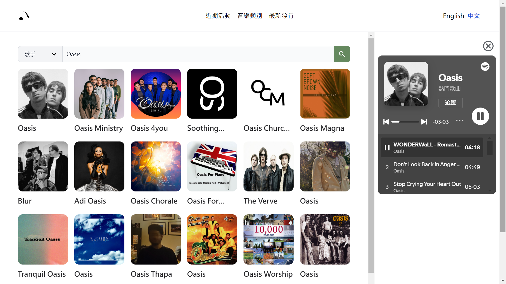
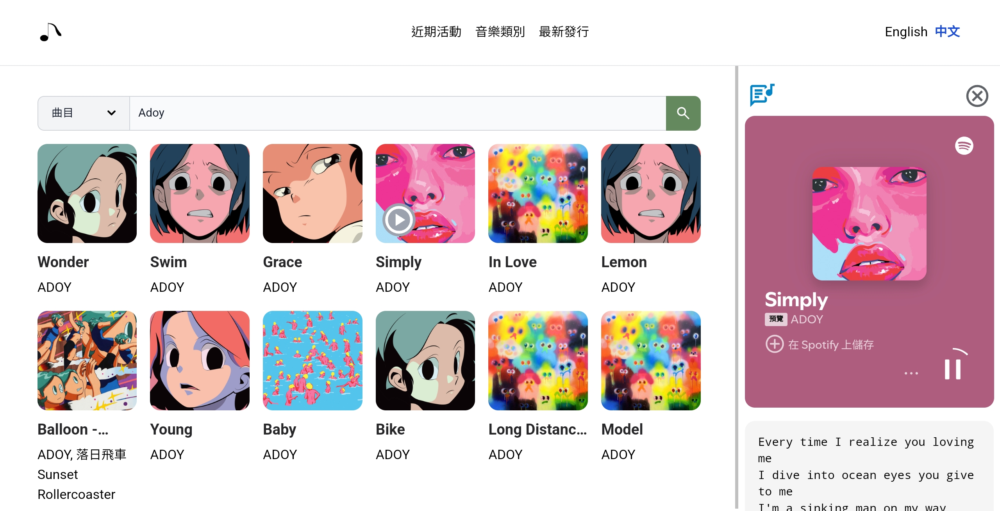
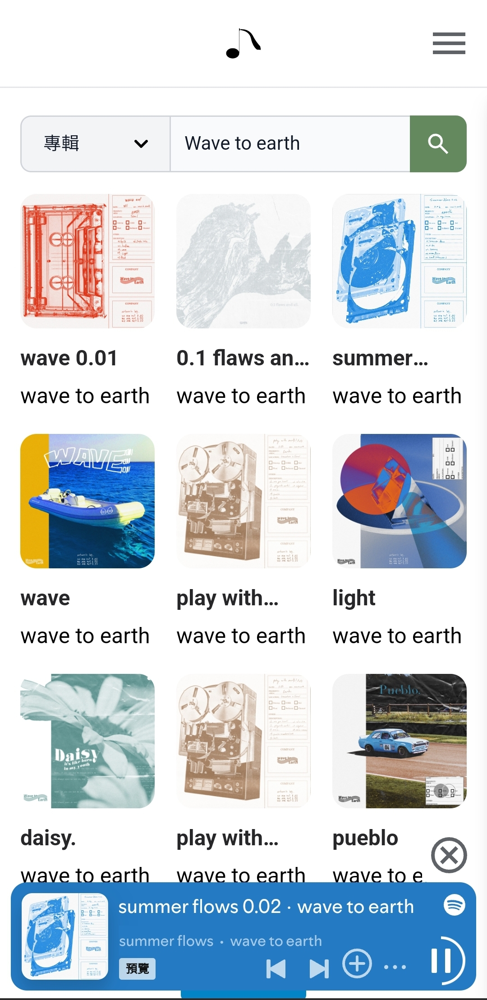

# Diary Music

Diary Music is a modern music discovery platform built with **Vue 3** that seamlessly integrates **Spotify**, **Musixmatch**, and **Taiwan's Ministry of Culture Arts & Culture Events API** to provide a comprehensive music and concert discovery experience.

🔗 **[Live Demo](https://diary-music.vercel.app/)**

---

## Features

- **Music Search**: Search for **artists, albums, playlists and tracks** with real-time data.
- **Music Exploration**: Browse **music genres** and **newly released albums**.
- **Arts & Culture Events**: View the latest concerts from the **Ministry of Culture API**.
- **Lyrics Lookup**: Get song lyrics via **Musixmatch API** (if applicable).
- **Listen to Music**: Play song previews directly from **Spotify API**.
- **Responsive Design**: Optimized for both desktop and mobile devices.

- **Music Discovery**
  - Search artists, albums, playlists, and tracks in real-time
  - Browse curated music genres
  - Explore newly released albums
  - View song lyrics via Musixmatch API
- **Events Integration**
  - Browse latest concerts and cultural events
  - View event details and locations
- **User Experience**
  - Responsive design (Mobile, Tablet, Desktop)
  - Multi-language support (English, Traditional Chinese)
  - Intuitive user interface

---

## Screenshots

### 🔹 Desktop Version

### 🔹 Tablet Version

### 🔹 Mobile Version

---

## Tech Stack

- **Frontend Framework**

  - Vue 3
  - TypeScript
  - Vite (Build tool)

- **State Management**

  - Pinia

- **Styling**

  - Tailwind CSS

- **Internationalization**

  - Vue I18n

- **APIs**
  - Spotify API
  - Musixmatch API
  - Ministry of Culture Arts & Culture Events API

---

## Usage

1. **Music Search**: Use the search bar to find artists, albums, playlists or tracks
2. **Browse Events**: Navigate to the Events section to view upcoming concerts
3. **Explore Genres**: Check out different music genres in the Genres section
4. **New Releases**: Stay updated with the latest album releases
